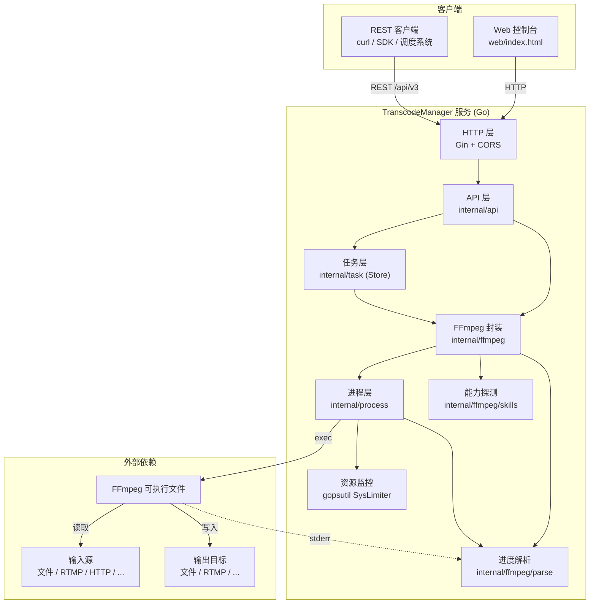
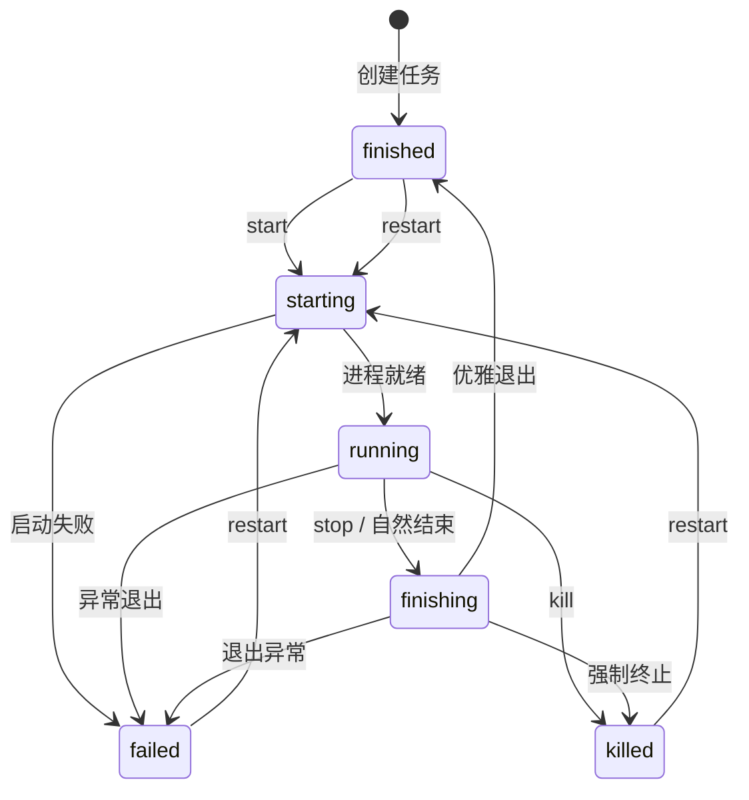
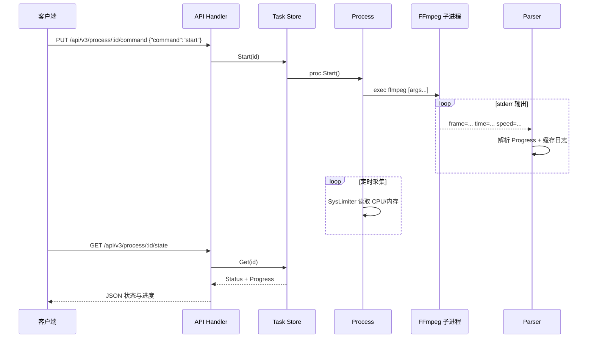

# TranscodeManager

基于 [Core](https://github.com/datarhei/core) 项目 FFmpeg 逻辑的**转码任务管理服务**。负责 FFmpeg 进程的创建、启停与监控，提供 REST API 与 Web 控制台；**不包含**媒体接入与分发层（RTMP/SRT/HTTP Server 等），仅作为 FFmpeg 的进程编排层使用。

## 功能

- **FFmpeg 进程管理**：创建、启动、停止、重启转码任务
- **进度解析**：解析 FFmpeg stderr，输出 frame、time、speed、size 等进度
- **CPU/内存监控**：采集运行中任务的实际 CPU 占用与内存使用（gopsutil）
- **Skills**：探测 FFmpeg 版本、编解码器、协议、滤镜等能力
- **REST API**：兼容 Core 的 `/api/v3/process` 设计，便于迁移与集成
- **Web 控制台**：单页静态前端，无需额外构建

## 系统架构

### 整体架构



### 模块职责

| 模块 | 路径 | 职责 |
|------|------|------|
| HTTP 入口 | `cmd/server` | 加载配置、初始化依赖、注册路由 |
| REST API | `internal/api` | 请求校验、JSON 序列化、错误响应 |
| 任务存储 | `internal/task` | 内存中管理任务生命周期，生成 FFmpeg 命令 |
| FFmpeg 封装 | `internal/ffmpeg` | 二进制校验、地址验证、Skills 加载、创建进程与解析器 |
| 进程控制 | `internal/process` | `exec.Cmd` 封装、状态机、自动重连、僵死检测 |
| 进度解析 | `internal/ffmpeg/parse` | 正则解析 stderr 中的 frame/time/speed 等 |
| 资源监控 | `internal/process/syslimiter` | 通过 gopsutil 采集 PID 级 CPU/内存 |

### 任务生命周期

每个转码任务对应一个 FFmpeg 子进程，由状态机驱动：



支持 **自动重连**（`reconnect: true`）：进程异常退出后按 `reconnect_delay_seconds` 延迟重启；**僵死检测**（`stale_timeout_seconds`）：长时间无 stderr 输出时判定为僵死并重启。

### 数据流（启动任务）



## 环境要求

- **Go** 1.23+
- **FFmpeg**：需在 PATH 中，或通过配置指定可执行路径

## 快速开始

```bash
# 构建
go build -o transcodemanager ./cmd/server

# 使用默认配置运行（监听 :8080）
./transcodemanager

# 使用配置文件
./transcodemanager -config config.yaml

# 命令行覆盖
./transcodemanager -bind :9000 -ffmpeg /opt/ffmpeg/bin/ffmpeg
```

启动后访问 http://localhost:8080 使用 Web 控制台。

> 需在项目根目录（含 `web/` 目录）下运行，前端才能正常加载。

## Docker 运行

项目支持 Docker 部署，镜像内已包含 FFmpeg 8.0（基于 `jrottenberg/ffmpeg`）：

```bash
# 构建并运行（docker-compose）
docker compose up -d --build

# 或仅构建镜像
docker build -t transcodemanager .

# 运行容器
docker run -d -p 8080:8080 -v $(pwd)/data:/data transcodemanager
```

启动后访问 http://localhost:8080。文件转码任务请将输入/输出路径置于挂载的 `/data` 目录下（如 `/data/input.mp4`）。

## Web 控制台

- **API Key**：右上角输入并保存，写入 localStorage；REST 请求带 `Authorization`，SSE 带 `?api_key=`
- **任务列表**：查看所有任务及状态；支持 Reference（服务端）、状态、任务 ID 筛选，条件同步到 URL（`?ref=&state=&id=`）
- **快捷操作**：复制任务 ID、一键复制 FFmpeg 命令、「复制配置」快速新建相似任务
- **添加任务**：支持多路输入/输出（动态增删），每路可单独配置地址与 FFmpeg 选项；全局选项放在「高级选项」
- **编辑任务**：回填全部输入/输出路数及全局选项
- **启停控制**：启动、停止、重启、删除（添加后默认不自动启动，需手动启动）
- **状态**：运行时长、CPU、内存、FFmpeg 进度（帧数、速度、已处理时长、输出大小）
- **命令**：查看生成的完整 FFmpeg 命令
- **日志**：查看 FFmpeg stderr 输出（含 frame/speed 等 progress 行）

## FFmpeg 命令生成规则

命令结构：`ffmpeg [全局选项] [输入选项] -i [输入地址] [输出选项] [输出地址]`

- **全局选项**（`options`）：放在命令最前
- **输入选项**：放在对应 `-i` 前，如 `-re -stream_loop -1`
- **输出选项**：音视频编解码与格式，放在输出地址前，如 `-vcodec copy -acodec copy -f flv`

示例（RTMP 拉流转推）：

```bash
ffmpeg -re -stream_loop -1 -i rtmp://live.example.com/stream \
  -vcodec copy -acodec copy -f flv rtmp://publish.example.com/push
```

## API 参考

| 方法 | 路径 | 说明 |
|------|------|------|
| GET | `/health/live` | 存活探针 |
| GET | `/health/ready` | 就绪探针（含 FFmpeg 版本） |
| GET | `/metrics` | Prometheus 指标（可配置路径） |
| GET | `/api/v3/skills` | FFmpeg 能力列表 |
| POST | `/api/v3/skills/reload` | 重新加载能力 |
| GET | `/api/v3/process/summary` | 任务数量汇总（按状态） |
| GET | `/api/v3/hooks` | 列出 Webhook 与 SSE 状态 |
| POST | `/api/v3/hooks/webhook` | 注册 Webhook |
| DELETE | `/api/v3/hooks/webhook/:id` | 删除 Webhook |
| GET | `/api/v3/events/stream` | SSE 任务事件流 |
| GET | `/api/v3/process` | 任务列表 |
| POST | `/api/v3/process` | 添加任务 |
| GET | `/api/v3/process/:id` | 任务详情 |
| PUT | `/api/v3/process/:id` | 更新任务 |
| DELETE | `/api/v3/process/:id` | 删除任务 |
| GET | `/api/v3/process/:id/config` | 任务配置 |
| GET | `/api/v3/process/:id/state` | 状态与进度 |
| GET | `/api/v3/process/:id/report` | 日志 |
| PUT | `/api/v3/process/:id/command` | start / stop / restart |

### 添加任务（文件转码）

```bash
curl -X POST http://localhost:8080/api/v3/process \
  -H "Content-Type: application/json" \
  -d '{
    "input": [{"address": "/path/to/input.mp4"}],
    "output": [{
      "address": "/path/to/output.mp4",
      "options": ["-c:v", "libx264", "-c:a", "aac"]
    }],
    "autostart": false
  }'
```

### 添加任务（RTMP 拉流转推）

```bash
curl -X POST http://localhost:8080/api/v3/process \
  -H "Content-Type: application/json" \
  -d '{
    "input": [{
      "address": "rtmp://live.example.com/app/stream",
      "options": ["-re", "-stream_loop", "-1"]
    }],
    "output": [{
      "address": "rtmp://publish.example.com/app/push",
      "options": ["-vcodec", "copy", "-acodec", "copy", "-f", "flv"]
    }],
    "autostart": false
  }'
```

### 启动 / 停止 / 重启

```bash
# 启动
curl -X PUT http://localhost:8080/api/v3/process/{id}/command \
  -H "Content-Type: application/json" \
  -d '{"command": "start"}'

# 停止
curl -X PUT http://localhost:8080/api/v3/process/{id}/command \
  -H "Content-Type: application/json" \
  -d '{"command": "stop"}'

# 重启
curl -X PUT http://localhost:8080/api/v3/process/{id}/command \
  -H "Content-Type: application/json" \
  -d '{"command": "restart"}'
```

### 任务配置字段

| 字段 | 类型 | 说明 |
|------|------|------|
| `id` | string | 任务 ID（可选，不填则自动生成） |
| `reference` | string | 业务引用标识，用于分组筛选 |
| `input` / `output` | array | 输入/输出列表，含 `address` 与 `options` |
| `options` | array | 全局 FFmpeg 选项 |
| `autostart` | bool | 创建后是否立即启动，默认 `false` |
| `reconnect` | bool | 异常退出后是否自动重连 |
| `reconnect_delay_seconds` | uint | 重连延迟（秒） |
| `stale_timeout_seconds` | uint | 无输出超时（秒），0 表示禁用 |
| `limits.cpu_usage` | float | CPU 上限（%），超限连续 3 秒则停止进程，0=不限 |
| `limits.memory_mbytes` | uint | 内存上限（MB），超限则停止，0=不限 |
| `limits.waitfor_seconds` | uint | 资源限制宽限期（秒），默认 5 |

## 配置

通过 `-config` 指定 YAML 配置文件（可选）：

```bash
./transcodemanager -config config.yaml
```

`config.yaml` 示例：

```yaml
server:
  bind: "0.0.0.0:8080"
  api_key: ""              # 非空时启用 API 鉴权
  cors:
    allowed_origins: []    # 空列表允许所有来源；生产环境建议配置白名单
    allow_credentials: false

ffmpeg:
  path: "ffmpeg"

logging:
  level: "info"
  format: "text"

observability:
  max_log_lines: 100
  metrics_enabled: true
  metrics_path: "/metrics"
  persist_path: "data/tasks.json"   # 任务持久化 JSON 路径

hooks:
  sse_enabled: true
  webhook_retries: 3
  webhook_retry_delay_seconds: 2
  webhooks:
    - url: "https://example.com/hooks/transcode"
      events: ["task.state_change"]
      states: ["failed", "killed"]
      secret: "your-hmac-secret"
```

命令行参数可覆盖配置：`-bind`、`-ffmpeg`。

### API 鉴权

配置 `server.api_key` 后，所有 `/api/v3/*` 请求需携带以下之一：

- Header: `Authorization: Bearer <key>`
- Header: `X-API-Key: <key>`
- Query: `?api_key=<key>`（SSE EventSource 使用此方式）

`/health/*`、Web UI、`/metrics` 不受鉴权影响。

### CORS 白名单

跨域前端（独立域名部署的管理台）需配置 `server.cors`：

```yaml
server:
  cors:
    allowed_origins:
      - "http://localhost:3000"
      - "https://admin.example.com"
    allow_credentials: false
```

- `allowed_origins` **为空**（默认）：允许所有来源，等同开发模式下的 `cors.Default()`
- **非空**：仅白名单内的 `Origin` 可跨域访问 API；允许方法 `GET/POST/PUT/DELETE/OPTIONS`，暴露 `X-Request-ID`
- 与 API 鉴权可同时启用：前端需在请求头携带 `Authorization` 或 `X-API-Key`

Web UI 与 API 同域部署时无需额外 CORS 配置。

### 任务持久化

设置 `observability.persist_path` 后，任务配置会在增删改时异步写入 JSON 文件，启动时自动恢复（**不会**自动启动 FFmpeg，需手动 start 或配置 `autostart`）。

### Hooks / Webhook

任务生命周期事件会通过 **Webhook**（HTTP POST）和 **SSE** 推送。

**事件类型：**

| 事件 | 触发时机 |
|------|----------|
| `task.created` | 任务创建 |
| `task.deleted` | 任务删除 |
| `task.state_change` | FFmpeg 进程状态变更 |

**Webhook 请求体示例：**

```json
{
  "type": "task.state_change",
  "task_id": "abc123",
  "reference": "live-stream-1",
  "from": "running",
  "to": "failed",
  "state": "failed",
  "timestamp": 1716288000
}
```

请求头包含 `X-Hook-Event`、`X-Hook-Task-ID`；若配置了 `secret`，额外附带 `X-Hook-Signature: sha256=<hmac>`。

**注册运行时 Webhook：**

```bash
curl -X POST http://localhost:8080/api/v3/hooks/webhook \
  -H "Content-Type: application/json" \
  -d '{
    "url": "https://example.com/hook",
    "events": ["task.state_change"],
    "states": ["failed", "killed"]
  }'
```

**SSE 订阅（浏览器 / 客户端）：**

```javascript
const es = new EventSource('/api/v3/events/stream');
es.addEventListener('task', (e) => console.log(JSON.parse(e.data)));
```

### Prometheus 指标

启用后访问 `/metrics`，主要指标：

| 指标 | 说明 |
|------|------|
| `transcodemanager_tasks{state}` | 各状态任务数量 |
| `transcodemanager_http_requests_total` | HTTP 请求计数 |
| `transcodemanager_http_request_duration_seconds` | HTTP 延迟 |
| `transcodemanager_task_state_changes_total` | 状态变更次数 |
| `transcodemanager_task_reconnects_total` | 异常后重连次数 |
| `transcodemanager_webhook_deliveries_total` | Webhook 投递成功/失败 |

## 项目结构

```
transcodemanager/
├── cmd/server/              # 主程序入口
├── internal/
│   ├── api/                 # REST API 与 handlers
│   ├── config/              # 配置加载
│   ├── ffmpeg/              # FFmpeg 封装
│   │   ├── parse/           # stderr 进度解析
│   │   └── skills/          # 能力探测
│   ├── logger/              # 日志（text/json、级别过滤）
│   ├── metrics/             # Prometheus 指标
│   ├── events/              # Webhook + SSE 事件分发
│   ├── process/             # 进程控制、状态机、资源监控
│   └── task/                # 任务定义与内存 Store
├── web/                     # 前端静态资源
│   └── index.html
├── config.yaml              # 配置示例
├── Dockerfile               # 多阶段构建（Go + FFmpeg 8.0）
├── docker-compose.yml
└── README.md
```

## 与 Core 的关系

TranscodeManager 提取了 Core 中与 FFmpeg 进程管理相关的核心逻辑，API 路径与数据结构保持兼容（`/api/v3/process`），适合以下场景：

- 只需 FFmpeg 转码编排，不需要 Core 的媒体服务器能力
- 轻量部署：单二进制 + FFmpeg，无数据库依赖（任务存于内存）
- 作为上层调度系统的 FFmpeg 执行节点

## License

MIT — 详见 [LICENSE](LICENSE)。
